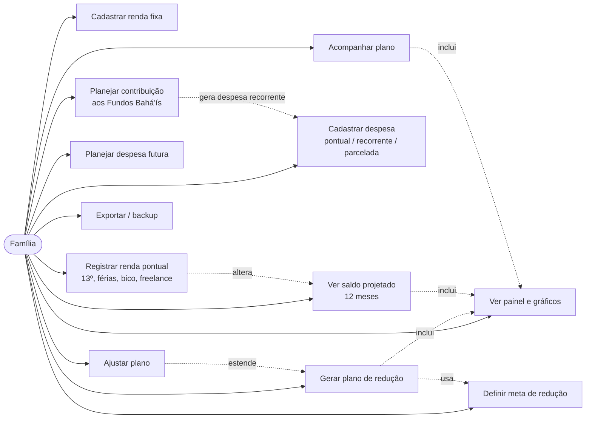

# Casos de uso

```mermaid
flowchart LR
  U([Família])
  U --> A[Cadastrar renda fixa]
  U --> A2[Registrar renda pontual<br/>13º, férias, bico, freelance]
  U --> J[Planejar contribuição<br/>aos Fundos Bahá’ís]
  U --> K[Ver saldo projetado<br/>12 meses]
  U --> B[Cadastrar despesa<br/>pontual / recorrente / parcelada]
  U --> C[Planejar despesa futura]
  U --> D[Ver painel e gráficos]
  U --> E[Definir meta de redução]
  U --> F[Gerar plano de redução]
  U --> G[Ajustar plano]
  U --> H[Acompanhar plano]
  U --> I[Exportar / backup]
  F -. inclui .-> D
  K -. inclui .-> D
  J -. gera despesa recorrente .-> B
  A2 -. altera .-> K
  H -. inclui .-> D
  F -. usa .-> E
  G -. estende .-> F
```
