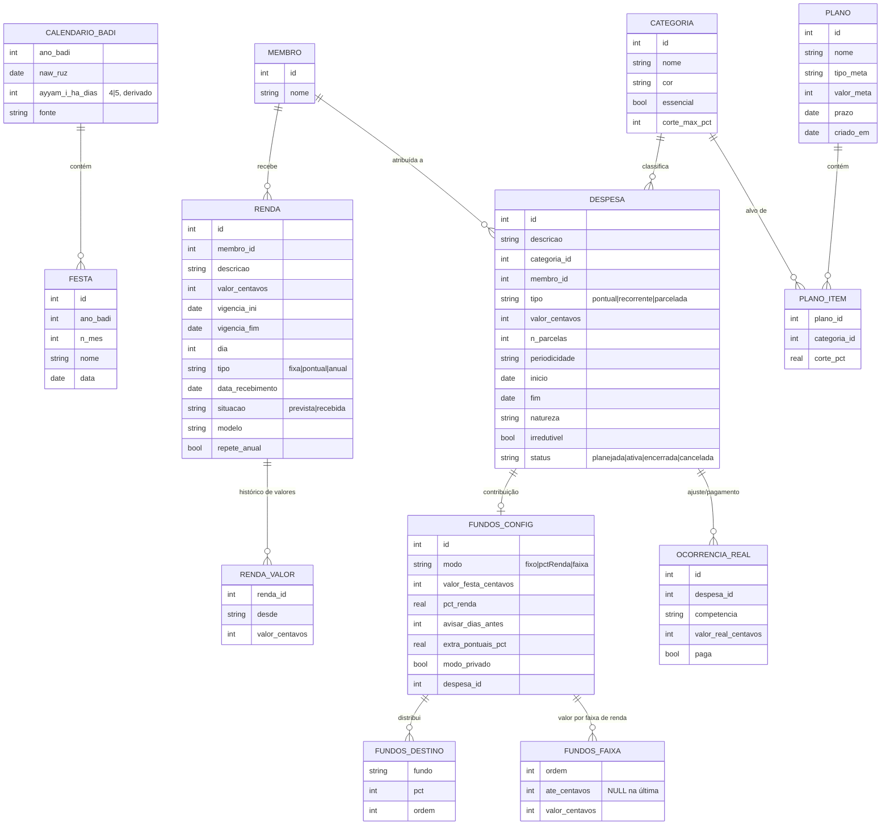

# Modelo de dados

```mermaid
erDiagram
  CALENDARIO_BADI ||--o{ FESTA : contém
  RENDA ||--o{ RENDA_VALOR : "histórico de valores"
  FUNDOS_CONFIG ||--o{ FUNDOS_DESTINO : distribui
  FUNDOS_CONFIG ||--o{ FUNDOS_FAIXA : "valor por faixa de renda"
  DESPESA ||--o| FUNDOS_CONFIG : "contribuição"
  MEMBRO ||--o{ RENDA : recebe
  MEMBRO ||--o{ DESPESA : "atribuída a"
  CATEGORIA ||--o{ DESPESA : classifica
  DESPESA ||--o{ OCORRENCIA_REAL : "ajuste/pagamento"
  PLANO ||--o{ PLANO_ITEM : contém
  CATEGORIA ||--o{ PLANO_ITEM : "alvo de"

  MEMBRO { int id string nome }
  RENDA { int id int membro_id string descricao int valor_centavos date vigencia_ini date vigencia_fim int dia string tipo "fixa|pontual|anual" date data_recebimento string situacao "prevista|recebida" string modelo bool repete_anual }
  CATEGORIA { int id string nome string cor bool essencial int corte_max_pct }
  DESPESA {
    int id string descricao int categoria_id int membro_id
    string tipo "pontual|recorrente|parcelada"
    int valor_centavos int n_parcelas string periodicidade
    date inicio date fim string natureza bool irredutivel string status "planejada|ativa|encerrada|cancelada"
  }
  OCORRENCIA_REAL { int id int despesa_id string competencia int valor_real_centavos bool paga }
  PLANO { int id string nome string tipo_meta int valor_meta date prazo date criado_em }
  PLANO_ITEM { int plano_id int categoria_id real corte_pct }
  RENDA_VALOR { int renda_id string desde int valor_centavos }
  FUNDOS_CONFIG { int id string modo "fixo|pctRenda|faixa" int valor_festa_centavos real pct_renda int avisar_dias_antes real extra_pontuais_pct bool modo_privado int despesa_id }
  FUNDOS_FAIXA { int ordem int ate_centavos "NULL na última" int valor_centavos }
  FUNDOS_DESTINO { string fundo int pct int ordem }
  CALENDARIO_BADI { int ano_badi date naw_ruz int ayyam_i_ha_dias "4|5, derivado" string fonte }
  FESTA { int id int ano_badi int n_mes string nome date data }
```
