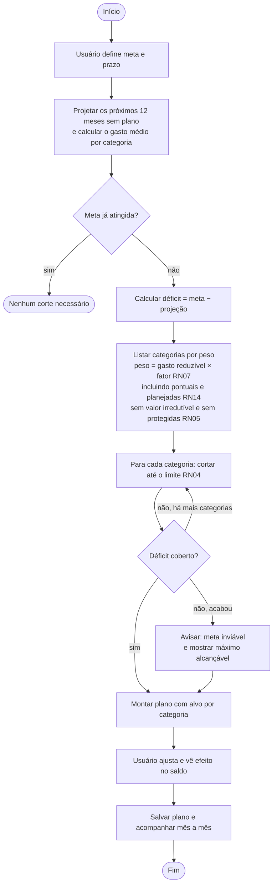

# Geração do plano de redução

```mermaid
flowchart TD
  S([Início]) --> M[Usuário define meta e prazo]
  M --> P[Projetar os próximos 12 meses sem plano<br/>e calcular o gasto médio por categoria]
  P --> Q{Meta já atingida?}
  Q -- sim --> Z([Nenhum corte necessário])
  Q -- não --> R[Calcular déficit = meta − projeção]
  R --> K[Listar categorias por peso<br/>peso = gasto reduzível × fator RN07<br/>incluindo pontuais e planejadas RN14<br/>sem valor irredutível e sem protegidas RN05]
  K --> L[Para cada categoria: cortar até o limite RN04]
  L --> T{Déficit coberto?}
  T -- não, há mais categorias --> L
  T -- não, acabou --> W[Avisar: meta inviável<br/>e mostrar máximo alcançável]
  T -- sim --> V[Montar plano com alvo por categoria]
  W --> V
  V --> X[Usuário ajusta e vê efeito no saldo]
  X --> Y[Salvar plano e acompanhar mês a mês]
  Y --> Z2([Fim])
```
