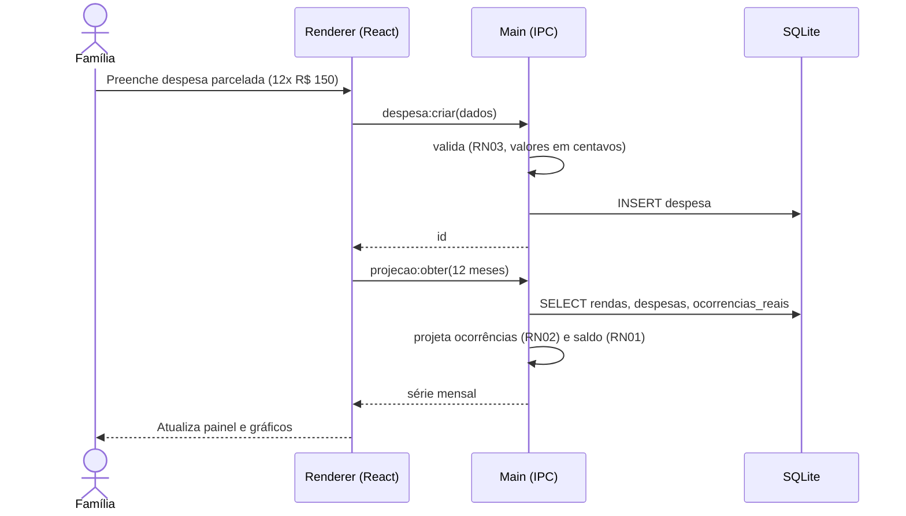

# Sequência: cadastrar despesa parcelada e ver o impacto

```mermaid
sequenceDiagram
  actor U as Família
  participant UI as Renderer (React)
  participant IPC as Main (IPC)
  participant DB as SQLite
  U->>UI: Preenche despesa parcelada (12x R$ 150)
  UI->>IPC: despesa:criar(dados)
  IPC->>IPC: valida (RN03, valores em centavos)
  IPC->>DB: INSERT despesa
  IPC-->>UI: id
  UI->>IPC: projecao:obter(12 meses)
  IPC->>DB: SELECT rendas, despesas, ocorrencias_reais
  IPC->>IPC: projeta ocorrências (RN02) e saldo (RN01)
  IPC-->>UI: série mensal
  UI-->>U: Atualiza painel e gráficos
```
