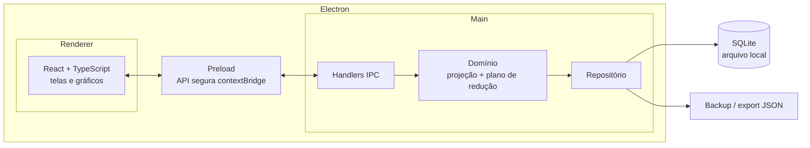

# Arquitetura

```mermaid
flowchart LR
  subgraph Electron
    subgraph Renderer
      UI[React + TypeScript<br/>telas e gráficos]
    end
    subgraph Main
      IPC[Handlers IPC]
      DOM[Domínio<br/>projeção + plano de redução]
      REPO[Repositório]
    end
    PRE[Preload<br/>API segura contextBridge]
  end
  DB[(SQLite<br/>arquivo local)]
  UI <--> PRE <--> IPC --> DOM --> REPO --> DB
  REPO --> BK[Backup / export JSON]
```
