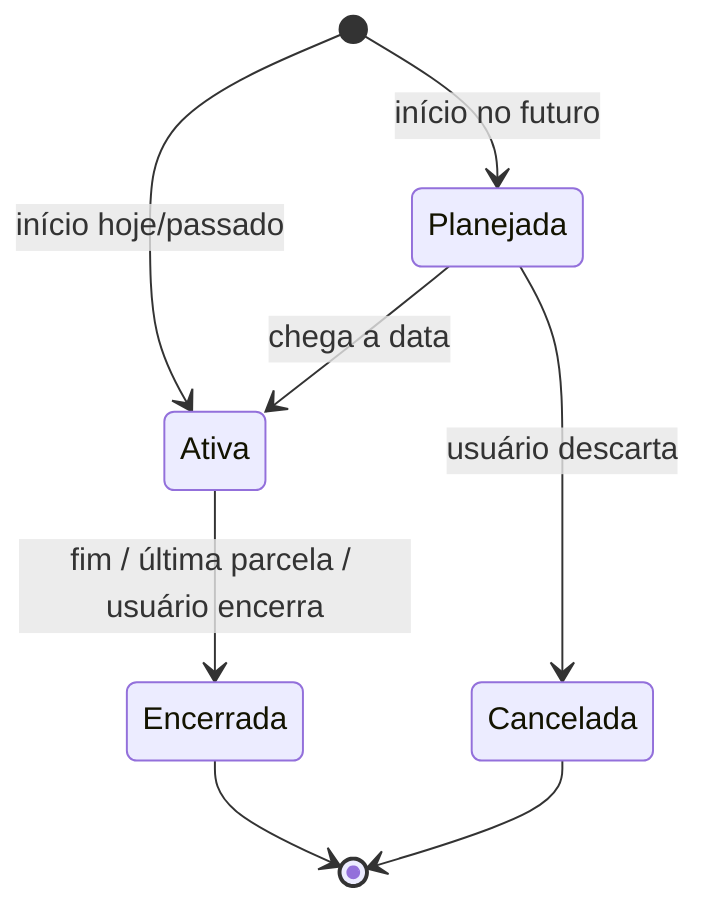

# Estados de uma despesa

```mermaid
stateDiagram-v2
  [*] --> Planejada: início no futuro
  [*] --> Ativa: início hoje/passado
  Planejada --> Ativa: chega a data
  Ativa --> Encerrada: fim / última parcela / usuário encerra
  Planejada --> Cancelada: usuário descarta
  Encerrada --> [*]
  Cancelada --> [*]
```
